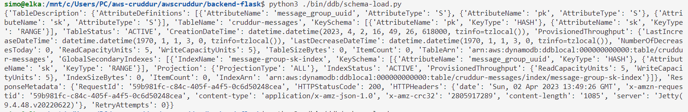
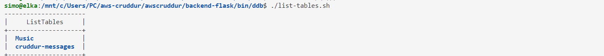
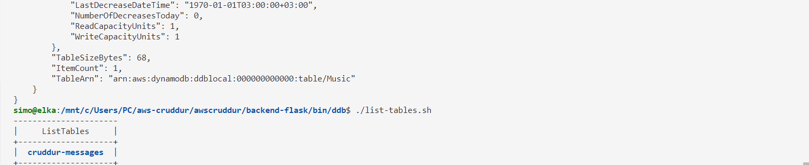

# Week 5 — DynamoDB and Serverless Caching

## Summary

### Environment

* Windows 10 -wsl
* Local

Started this week running the app locally, installing postgress and changing the default user in environment variables to `postgres`.

Verified that dynamodb is running and created my first table:




Dealt with `M: bad interpreter: No such file or directory"`issue and could solve it with the following command:

```bash
sed -i -e 's/\r$//' list-tables.sh
./list-tables.sh
```
Note: *The first line of my `schema-load` running python script was `#!/usr/bin/python3`.*



Now I could change my `.py` files to `.sh`. Now i had only one table.

```bash
aws dynamodb delete-table --endpoint-url=http://localhost:8000\
    --table-name Music
    --output table
```

