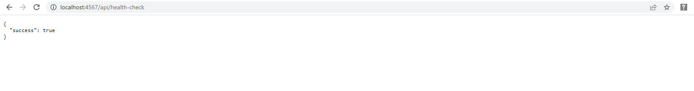

# Week 6 — Deploying Containers

## Summary

This week i worked on the following and wrote an article on linkedin covering the ECS part I.

* Provisioned an ECS Cluster, ECR repos. Pushed images for backend-flask, base-python, frontend-react, base-node.
* Deployed Backend Flask app and React JS app as a service to Fargate
* Secured flask against arbitrary code execution by not running in debug mode.
* Change Docker Compose file to explicitly use a user-defined network named cruddur-net
* 
### ECS Fargate

I edited dockerfiles to pull from ecr and verified newly created endpoint.




```bash
aws ssm put-parameter --type "SecureString" --name "/cruddur/backend-flask/AWS_ACCESS_KEY_ID" --value $AWS_ACCESS_KEY_ID
aws ssm put-parameter --type "SecureString" --name "/cruddur/backend-flask/AWS_SECRET_ACCESS_KEY" --value $AWS_SECRET_ACCESS_KEY
aws ssm put-parameter --type "SecureString" --name "/cruddur/backend-flask/CONNECTION_URL" --value $PROD_CONNECTION_URL
```


### giving access to ECS tasks


### frontend

```sh
docker build \
--build-arg REACT_APP_BACKEND_URL="api.cruddur.com" \
--build-arg REACT_APP_AWS_PROJECT_REGION="$AWS_DEFAULT_REGION" \
--build-arg REACT_APP_AWS_COGNITO_REGION="$AWS_DEFAULT_REGION" \
--build-arg REACT_APP_AWS_USER_POOLS_ID="ca-central-1_CQ4wDfnwc" \
--build-arg REACT_APP_CLIENT_ID="5b6ro31g97urk767adrbrdj1g5" \
-t frontend-react-js \
-f Dockerfile.prod \
.
```


* Creating endpoint for health-check
* Create CloudWatch Log Group
* Create ECS Cluster

Create ECR repo and push image
* Login to ECR

**For Base-image python**

* create-repository cruddur-python
* set/export ECR_PYTHON_URL
* Pull python:3.10-slim-buster from dockerhub
* Tag local slim buster as $ECR_PYTHON_URL:3.10-slim-buster
* Push $ECR_PYTHON_URL:3.10-slim-buster
Now we have Base-image python on our AWS private repo (ECR)

**For backend-flask**

* Create backend-flask Repo
* Set/export $ECR_BACKEND_FLASK_URL
* Update dockerfile to use our $ECR_PYTHON_URL:3.10-slim-buster
* Build Image backend-flask
* Tag as $ECR_BACKEND_FLASK_URL:latest
* Push $ECR_BACKEND_FLASK_URL:latest

**For Base-image node**

* create-repository cruddur-react-js
* set/export ECR_REACT_JS_URL
* Pull node:16.19.1 from dockerhub
* Tag local node as $ECR_REACT_JS_URL:16.19.1
* Push $ECR_REACT_JS_URL:16.19.1 to ECR

Now we have Base-image node on ECR

**For Frontend React JS**

* Create frontend-react-js repo
* Set/export $ECR_FRONTEND_REACT_URL
* Update dockerfile.prod to use our $ECR_REACT_JS_URL:16.19.1
* Build Image using Dockerfile.prod (it has build-args)
* Tag Image as $ECR_FRONTEND_REACT_URL:latest
* Push Image $ECR_FRONTEND_REACT_URL:latest


### Register Task Defintions

**execution role**

Create the following:
* create-role=CruddurServiceExecutionRole
* create-role=CruddurServiceExecutionPolicy
* put-role-policy=CruddurServiceExecutionPolicy
* attach-role-policy=CruddurServiceExecutionRole

**task role**

Create the following

* create-role=CruddurTaskRole
* put-role-policy=CruddurTaskRole
* attach-role-policy=CruddurTaskRole(CloudWatchFullAccess )

**Create task definition json files**

* backend-flask.json
* frontend-react.json

and register the above task-definition files.


**Create Security Group**

* name the sg as CRUD_SERVICE_SG
* authorize-security-group-ingress with the group id $CRUD_SERVICE_SG
* Update RDS SG to allow access for the last security group (authorize-security-group-ingress)


**Create/test Services(task definition files)**

* Connect to the EC2 instance to test backend and frontend svcs using sessions manager

**Test RDS Connection**

* Connect to the backend EC2 and test Flask App is running
* Check endpoint against Public IP (health-check)
* Can also use execute-command to connect via Sessions Manager (Fargate) after installing session-manager-plugin
