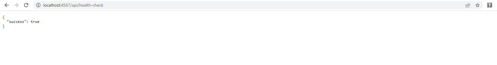
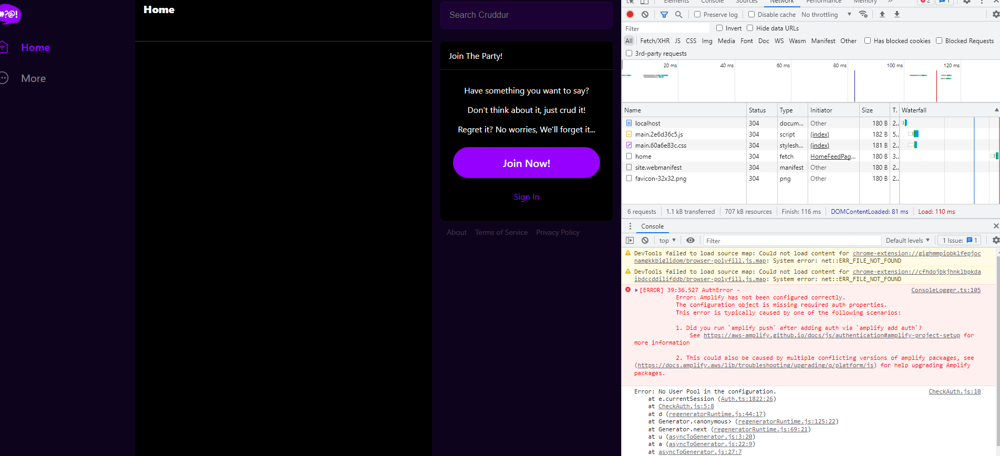

# Week 6 — Deploying Containers

## Summary

This week i worked on the following and wrote an article on linkedin covering the ECS part I.

* Provisioned an ECS Cluster, ECR repos. Pushed images for backend-flask, base-python, frontend-react, base-node.
* Deployed Backend Flask app and React JS app as a service to Fargate
* Secured flask against arbitrary code execution by not running in debug mode.
* Change Docker Compose file to explicitly use a user-defined network named cruddur-net
* 
### ECS Fargate

I edited dockerfiles to pull from ecr and verified newly created endpoint.

Debugging: `nsoleLogger.ts:105 [ERROR] 39:36.527 AuthError - 
            Error: Amplify has not been configured correctly. 
 ` error:

